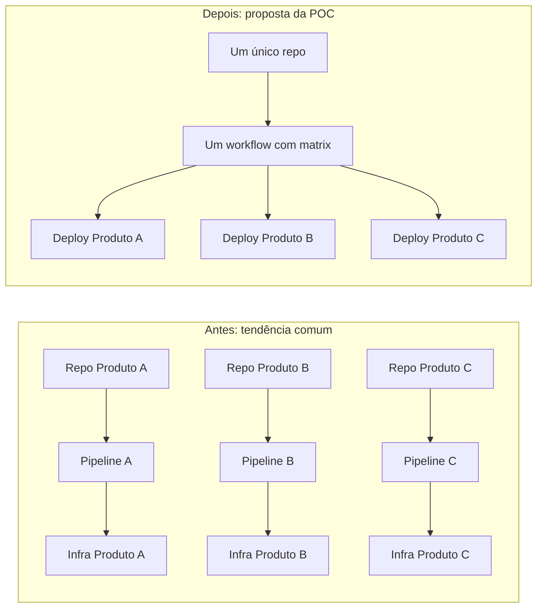
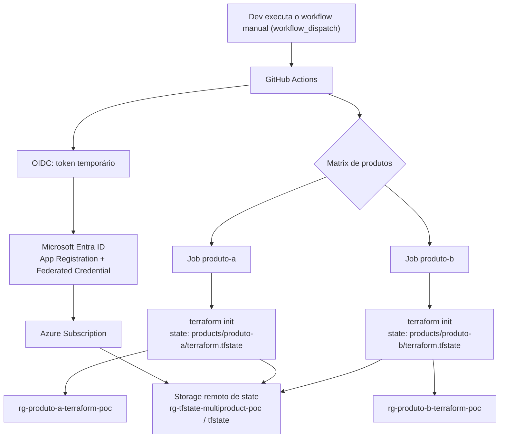
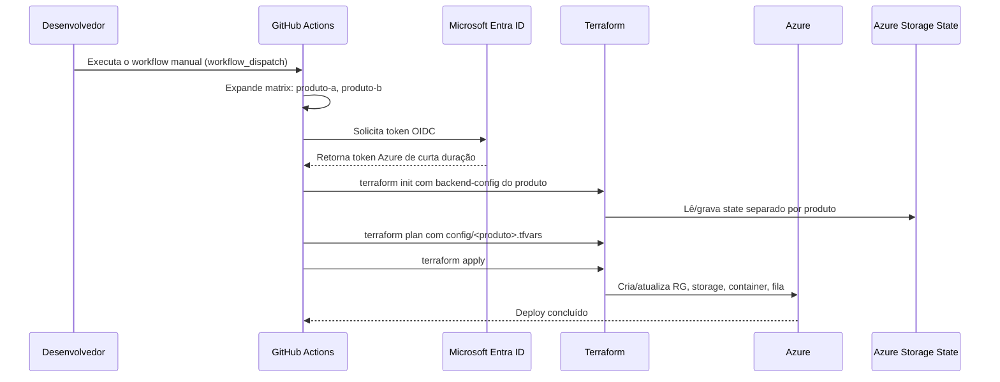
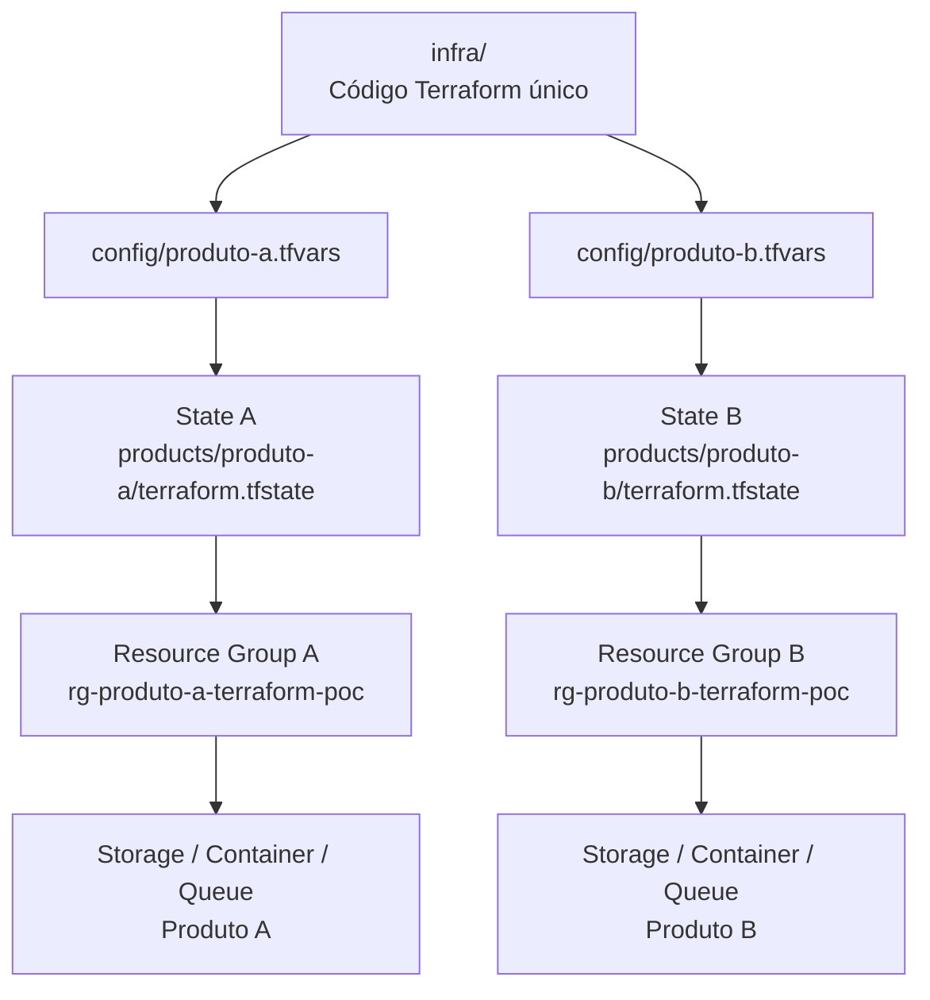
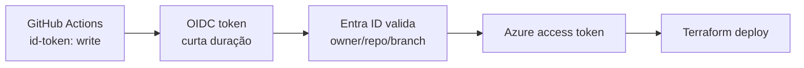
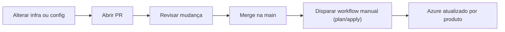

# Guia da POC - Multi Deploy Terraform

## Resumo executivo

Esta POC demonstra como usar **um único repositório** para fazer **múltiplos deployments independentes no Azure**, um para cada produto, sem duplicar código Terraform.

O padrão é simples:

- o código de infraestrutura fica uma vez em `infra/`;
- cada produto tem apenas um arquivo de configuração em `config/`;
- o GitHub Actions executa uma matriz de produtos;
- cada produto usa um **state Terraform separado**;
- cada produto cria recursos em um **grupo de recursos separado**.

Resultado: o time consegue escalar de 2 para N produtos adicionando configuração, não copiando projeto.

## A dor que a POC resolve

O cenário-alvo é equivalente a:

> "Tenho um mesmo sistema, mas preciso subir infra independente por produto. Cada produto pode ter banco, storage, filas, DNS e escala próprios. Não quero copiar o repositório nem manter pipelines duplicadas."

Esta POC responde com um modelo de **código único + configuração por produto + execução independente**.



## Visão geral da arquitetura



## Como o deploy acontece



## Isolamento por produto

Mesmo com um único código Terraform, cada produto tem fronteiras próprias:



| Item | Produto A | Produto B |
| --- | --- | --- |
| Configuração | `config/produto-a.tfvars` | `config/produto-b.tfvars` |
| State | `products/produto-a/terraform.tfstate` | `products/produto-b/terraform.tfstate` |
| Grupo de recursos | `rg-produto-a-terraform-poc` | `rg-produto-b-terraform-poc` |
| Execução | Job matrix `produto-a` | Job matrix `produto-b` |

## Escopo desta POC e extensões

A POC demonstra concretamente o **padrão**, com recursos simples e baratos por produto:

- grupo de recursos;
- storage account;
- container de blob;
- fila (queue).

A visão completa mencionada no cenário-alvo (banco de dados, DNS e escala própria por produto) **usa exatamente o mesmo padrão** — basta acrescentar recursos no código único em `infra/`, parametrizados por `tfvars`. Esses itens entram como extensão:

| Necessidade | Como estender (mesmo padrão, sem duplicar código) |
| --- | --- |
| Banco de dados por produto | Adicionar um recurso de banco no `infra/` (ex.: `azurerm_postgresql_flexible_server`), parametrizado por `tfvars`. |
| Filas de movimento | Já demonstrado via `azurerm_storage_queue`; pode evoluir para Service Bus por produto. |
| DNS por produto | Adicionar zona/registro DNS no `infra/` (ex.: `azurerm_dns_zone` ou DNS privado) para roteamento por produto. |
| Escala de execução (ex.: 1000 pods de um produto, 100 de outro) | Camada de **runtime**, não de IaC por produto: a infra por produto fica isolada aqui, e a escala de pods/réplicas é configurada no orquestrador (ex.: AKS/replicas/HPA) por produto. |

Ou seja: o que muda entre produtos é **configuração**, não código.

## Estrutura do repositório

```text
repo/
|-- .github/
|   `-- workflows/
|       `-- deploy.yml
|-- bootstrap/
|   |-- README.md
|   `-- bootstrap-state.ps1
|-- config/
|   |-- produto-a.tfvars
|   `-- produto-b.tfvars
|-- docs/
|   |-- GUIA_POC.md
|   `-- diagrams/
|       |-- 01-visao-geral.excalidraw
|       |-- 02-fluxo-deploy.excalidraw
|       `-- 03-isolamento-produtos.excalidraw
`-- infra/
    |-- backend.tf
    |-- main.tf
    |-- outputs.tf
    |-- providers.tf
    |-- variables.tf
    `-- versions.tf
```

## O que cada pasta faz

| Pasta/arquivo | Função |
| --- | --- |
| `.github/workflows/deploy.yml` | Pipeline GitHub Actions com matrix por produto. |
| `bootstrap/bootstrap-state.ps1` | Prepara Azure + GitHub OIDC + state remoto do Terraform. |
| `config/*.tfvars` | Define o que muda por produto. |
| `infra/*.tf` | Código Terraform reutilizável. |
| `docs/diagrams/*.excalidraw` | Diagramas editáveis para apresentação/arquitetura. |

## Segurança: por que OIDC

O workflow não usa senha ou client secret Azure. Ele usa OIDC:



O Entra ID só aceita tokens com o subject configurado:

```text
repo:EdneiMonteiro/multi-product-terraform-github-actions:ref:refs/heads/main
```

Ou seja, apenas esse repositório e branch conseguem obter token para deploy.

## Como adicionar um novo produto

1. Criar um novo arquivo:

   ```text
   config/produto-c.tfvars
   ```

2. Preencher os valores específicos:

   ```hcl
   product             = "produto-c"
   environment         = "poc"
   location            = "brazilsouth"
   resource_group_name = "rg-produto-c-terraform-poc"
   ```

3. Adicionar uma entrada na matrix:

   ```yaml
   - product: produto-c
     tfvars: config/produto-c.tfvars
     state_key: products/produto-c/terraform.tfstate
   ```

4. Executar o workflow manualmente (`workflow_dispatch`), escolhendo `plan` ou `apply`.

Não é necessário copiar a pasta `infra/` nem criar uma pipeline nova.

## O que foi implantado nesta POC

| Produto | Grupo de recursos | Storage account |
| --- | --- | --- |
| produto-a | `rg-produto-a-terraform-poc` | gerado pelo Terraform |
| produto-b | `rg-produto-b-terraform-poc` | gerado pelo Terraform |

States remotos confirmados:

```text
products/produto-a/terraform.tfstate
products/produto-b/terraform.tfstate
```

Workflow validado:

```text
Multi Deploy Terraform
status: sucesso
trigger: workflow_dispatch
```

## Ciclo operacional



Para produção, recomenda-se evoluir para:

- separar `plan` e `apply`;
- exigir aprovação manual para `apply`;
- usar GitHub Environments;
- separar identidade de leitura/plan da identidade de escrita/apply;
- incluir policy-as-code e validações adicionais.

## Mensagem principal

Esta abordagem permite manter **um único repositório governado**, com **infraestrutura isolada por produto**, **state independente**, **deploy automatizado no Azure** e **baixo esforço para adicionar novos produtos**.
